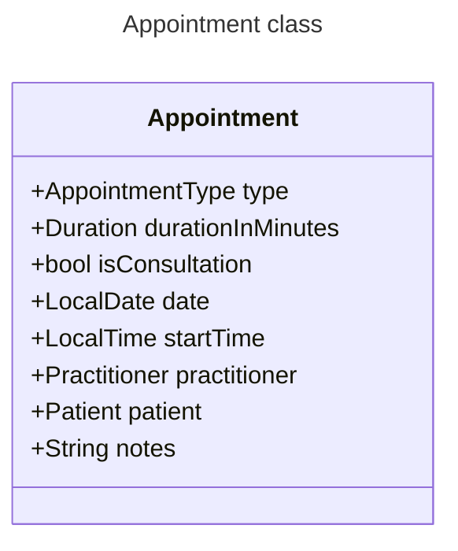
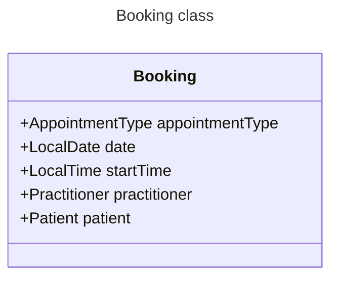
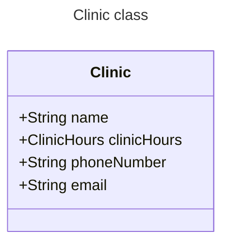
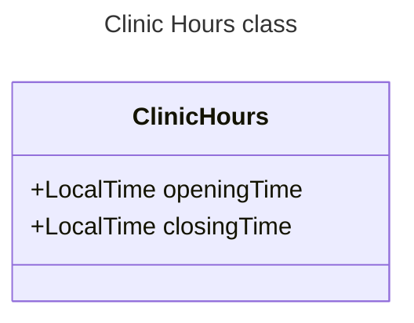
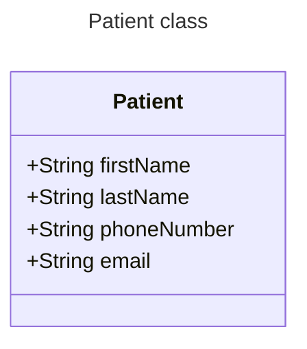
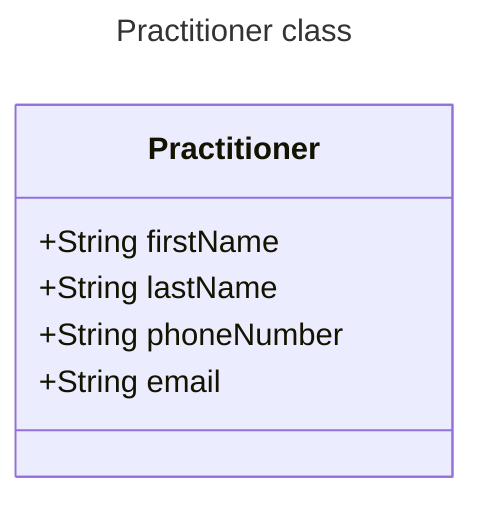
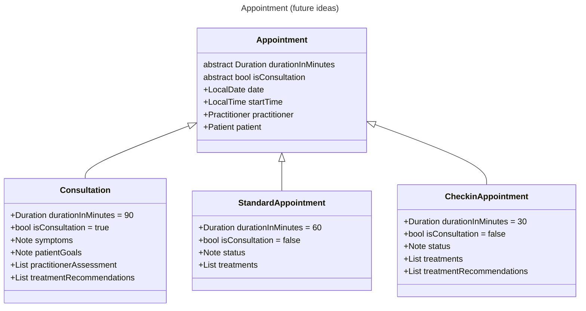

`AppointmentType` is an enum of `Consultation`, `StandardAppointment`, and `CheckinAppointment`
`durationInMinutes` and `isConsultation` are read only properties delegated to AppointmentType.

